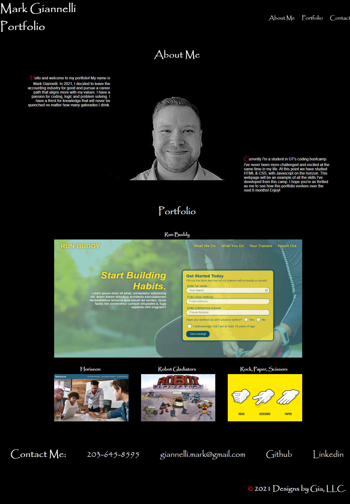

# mark-giannelli-portfolio

## Challenge Requirements
* Create a portfolio that includes the developer's name, a recent photo or avatar, and links to sections about them, their work, and how to contact them.
* Add links to the Nav headers so when you click them you get sent to the section.
* Include titled images of developer's apps, where the first application's image should be larger than the others and all images should be clickable and take you to the deployed page.
* Make the page responsive and adaptive to various screen sizes and devices.

## Final Website Screenshot

## Link to Portfolio Website
[Portfolio Deployed Website](https://www.markgiannelli.com/)